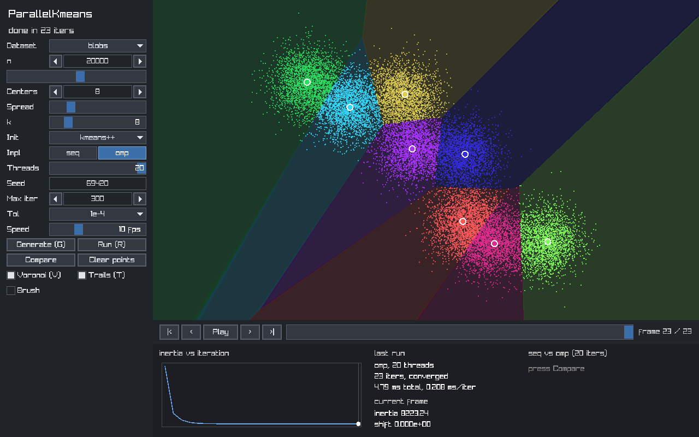
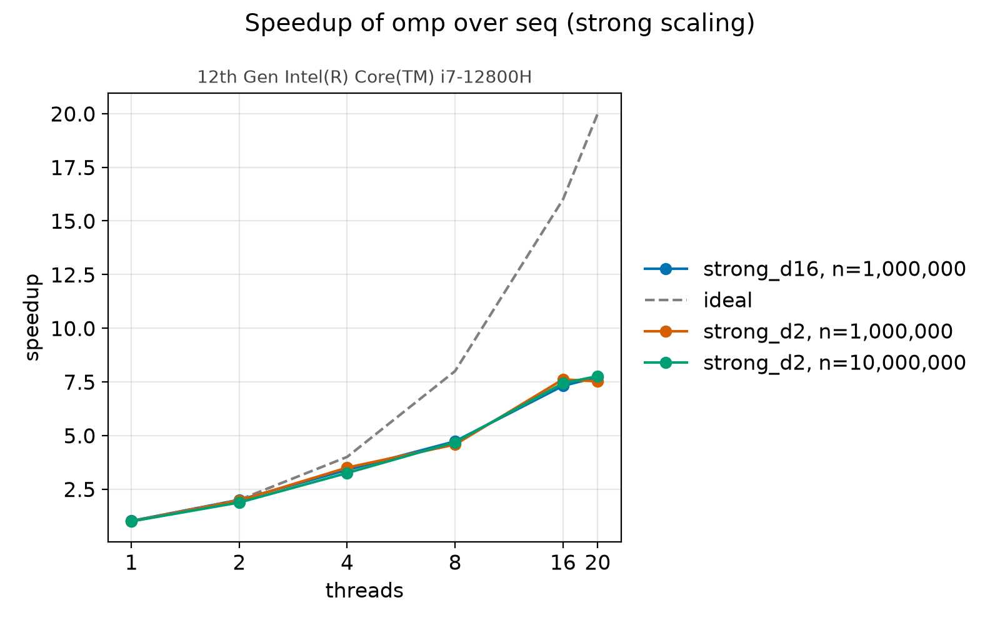
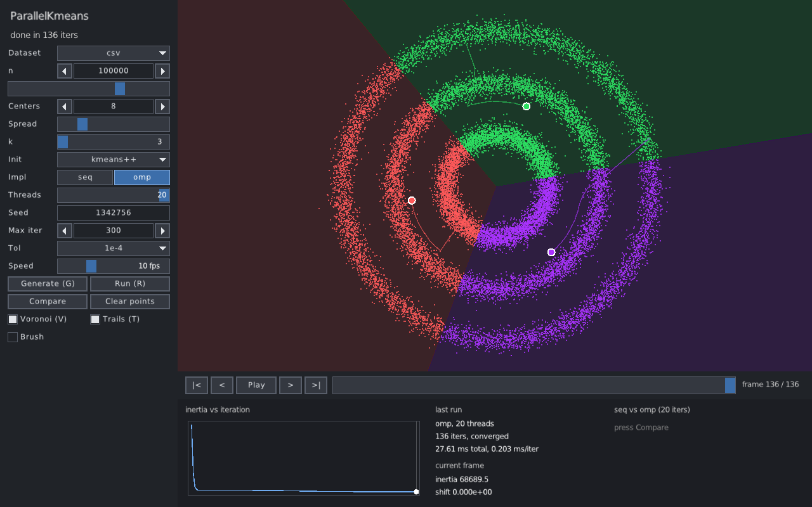
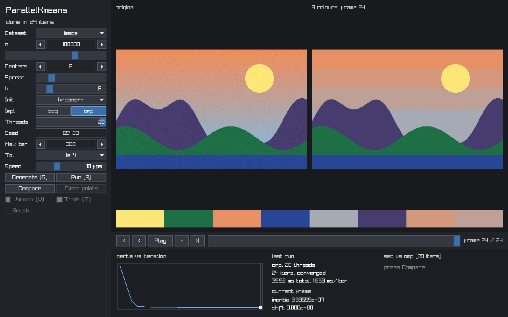

# ParallelKmeans

K-Means clustering in C with a sequential baseline, an OpenMP parallel version, a command-line tool and a small GUI.



[Try it in the browser](https://jnunomcosta.github.io/ParallelKmeans/kmeans-gui.html).
The web demo is the GUI compiled to WebAssembly and runs on a single thread;
the benchmarks in this repository are native.

## What this is

This started as an assignment for an MSc Parallel Computing class: three
separate C programs that parallelized K-Means with OpenMP. This branch is a
revamp. It replaces them with one library that has exactly two implementations,
`seq` and `omp`, a CLI, a benchmark suite with reference results, and a GUI.
The [write-up](docs/parallelization.md) covers what was wrong with the
original code and how the new one is built.

## Highlights

- One shared Lloyd driver. `seq` and `omp` differ only in the assignment step,
  so comparing them is like for like (`src/kmeans.c`, `src/assign_*.c`).
- Per-thread accumulators padded to 64-byte cache lines: memory is
  `O(threads·k·d)`, independent of `n`. The original second parallel version
  needed `O(k·threads·n)`.
- Results are deterministic for a fixed thread count, and `omp` is checked
  against `seq` by unit tests and by a correctness gate inside `kmeans bench`.
- Up to 7.77x speedup on 20 threads (`docs/bench/strong_d2.csv`, n=1e7). The
  CPU is a hybrid i7-12800H and scaling flattens past 8 threads, as the
  write-up discusses.
- Float storage with double accumulation, k-means++ and random initialization,
  CSV input and output.
- A raylib GUI with iteration playback, Voronoi regions, a point brush, a
  seq-vs-omp comparison and an image color quantization mode.

## Results



Median of 5 runs, 50 fixed iterations per run, blobs data, on the i7-12800H in
[`docs/bench/machine.txt`](docs/bench/machine.txt) (14 cores, 20 threads).

| Suite | seq (ms/iter) | omp, 20 threads (ms/iter) | Speedup | Efficiency |
|---|---|---|---|---|
| d=2, k=8, n=1e6 | 30.59 | 4.07 | 7.52 | 0.38 |
| d=2, k=8, n=1e7 | 309.47 | 39.85 | 7.77 | 0.39 |
| d=16, k=32, n=1e6 | 171.72 | 22.24 | 7.72 | 0.39 |
| weak, d=2, 1e6 points per thread | 33.64 (1 thread) | 76.88 | | 0.44 |

Higher dimension did not scale noticeably better than dimension 2 in these
runs. [`docs/parallelization.md`](docs/parallelization.md) has all the plots,
the interpretation, the legacy comparison and the limitations.

## Build

Requirements: CMake 3.21 or newer, a C11 compiler with OpenMP. Tested with gcc
15.2.0 on Ubuntu (see `docs/bench/machine.txt`).

```bash
cmake --preset release && cmake --build --preset release -j
```

The binary is `build/release/apps/cli/kmeans`. Release builds use
`-march=native`; turn that off with `-DKMEANS_NATIVE=OFF` for a portable binary.

The GUI is optional. It downloads raylib 5.5 and raygui 4.0 while configuring,
and needs these Ubuntu packages:

```bash
sudo apt install libx11-dev libxrandr-dev libxinerama-dev libxcursor-dev libxi-dev libgl1-mesa-dev
cmake --preset gui && cmake --build --preset gui -j
```

The binary is `build/gui/apps/gui/kmeans-gui`. It uses X11 (XWayland on Wayland).

## Usage

The examples write `kmeans` for `build/release/apps/cli/kmeans`.

Generate a dataset (`uniform`, `blobs` or `rings`) as CSV:

```console
$ kmeans gen --dataset blobs --n 100000 --centers 8 -o blobs.csv
wrote 100000 points (dim 2) to blobs.csv
```

Cluster it:

```console
$ kmeans run -i blobs.csv -k 8 --impl omp -t 4
impl        omp
threads     4
n           100000
dim         2
k           8
init        kmeans++
iterations  61
converged   yes
inertia     4.143481e+04
total ms    52.873
ms/iter     0.867
centroids
  0: 4.11417 8.48753
  ...
```

Benchmark `seq` against `omp` at several thread counts. Every row is checked
against `seq` first, and a mismatch exits with status 3. Add `--csv FILE` to
save the table.

```console
$ kmeans bench --n 1e6 --k 8 --threads 1,4,20 --repeat 3 --iters 20
# kmeans 2.0.0
# compiler: 15.2.0
...
scaling impl          n    k threads   median_s      min_s   stddev_s per_iter_ms  speedup    effic     karp
strong  seq     1000000    8       1    0.61507    0.61454    0.00040     30.7536        -        -        -
strong  omp     1000000    8       1    0.61469    0.61382    0.00236     30.7347  1.00062  1.00062        -
strong  omp     1000000    8       4    0.18203    0.18035    0.00500      9.1016  3.37891 0.844727 0.0612713
strong  omp     1000000    8      20    0.07713    0.07435    0.00257      3.8566  7.97432 0.398716 0.0793711
```

Timings in these examples are from one run on the machine above and will differ
elsewhere. The reference suite is `bench/run.sh`, and the plots are made by
`bench/plot.py`; the commands are in the write-up.

### GUI

```bash
build/gui/apps/gui/kmeans-gui --dataset blobs --n 20000 -k 8
build/gui/apps/gui/kmeans-gui --image photo.png -k 8
```

The left panel sets the dataset, `k`, initialization, implementation, threads
and tolerance. Each run is recorded frame by frame, so the timeline can replay
or scrub through the iterations while the plot at the bottom shows inertia.
Compare runs `seq` and `omp` on the same data and shows both times.

| Key | Action |
|---|---|
| `G` / `R` | generate new data / run |
| `V` / `T` | toggle Voronoi regions / centroid trails |
| `Space` | play or pause the timeline |
| `Left` / `Right`, `Home` / `End` | step frames, jump to first or last |
| `Esc` | cancel the running clustering, or quit |

With Brush on, dragging on the canvas paints points. Dragging a centroid sets
a starting position. A `.csv` or image file dropped on the window is loaded.
`--screenshot FILE.png [--frame N]` renders one frame and exits.

K-Means on three concentric rings shows where the method fails: it splits the
plane into convex regions, so every ring is cut across.



In image mode the pixels are the points and the centroids become the palette.
This screenshot uses a generated test image, not a photograph.



## Project layout

```
CMakeLists.txt  CMakePresets.json  .clang-format  requirements-dev.txt
include/kmeans/kmeans.h   the public API
src/                      library: rng, dataset, csv, init, driver, assign_seq, assign_omp
apps/cli/                 kmeans gen / run / bench
apps/gui/                 kmeans-gui (optional, preset gui)
tests/                    C unit tests and CLI tests, run by CTest
bench/                    run.sh, plot.py
docs/                     parallelization.md, bench/ (CSVs, plots), img/
.github/workflows/ci.yml
```

## Testing

```bash
ctest --preset release                                   # 21 tests
cmake --preset asan && cmake --build --preset asan -j && ctest --preset asan
```

The `asan` preset builds with AddressSanitizer and UndefinedBehaviorSanitizer.
The format check is `git ls-files '*.c' '*.h' | xargs .venv/bin/clang-format --dry-run --Werror`
(install clang-format with `pip install -r requirements-dev.txt` in a venv).
GitHub Actions (`.github/workflows/ci.yml`) builds and tests with gcc and
clang, runs the sanitizer build, checks formatting, and builds the GUI.

## License

MIT. See [LICENSE](LICENSE).
