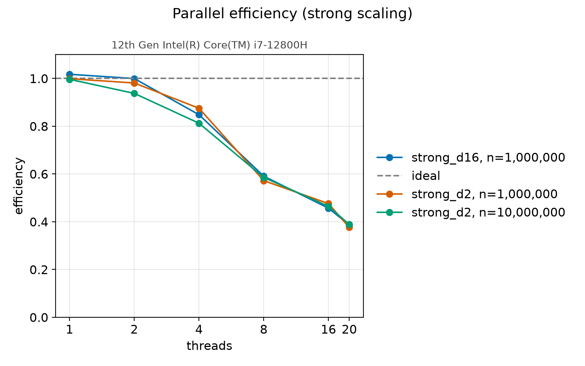
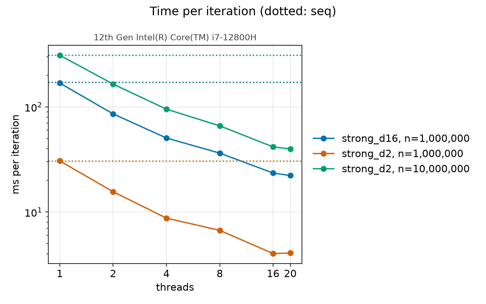
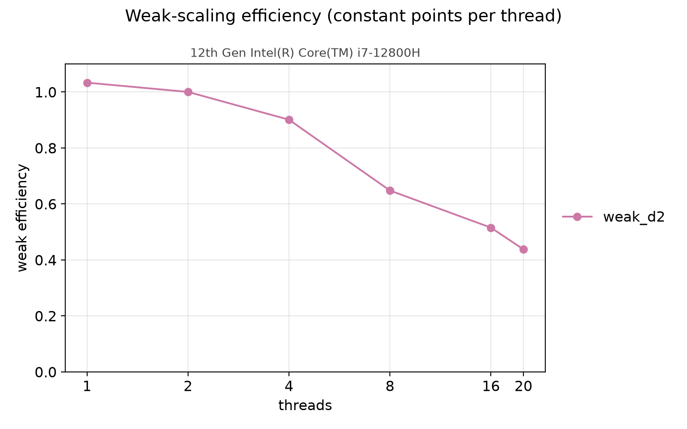
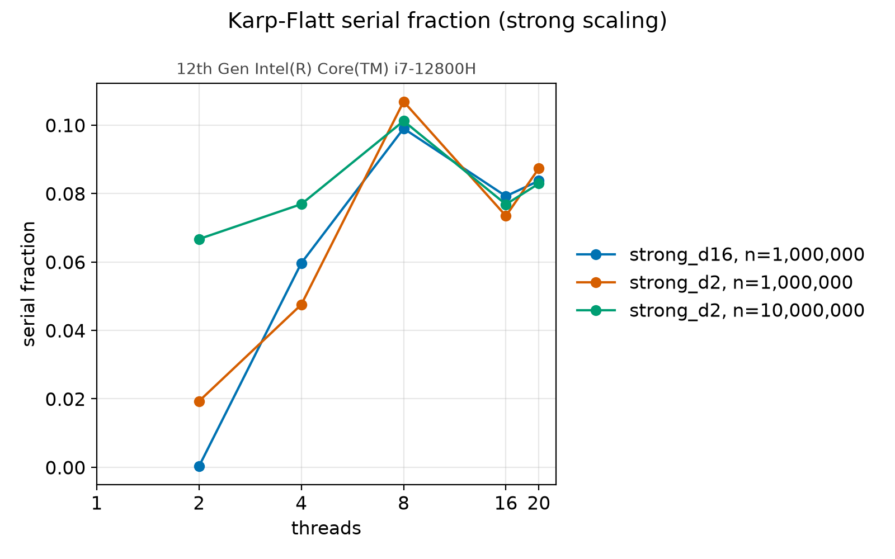

# Parallelizing K-Means with OpenMP

This document explains how the project's parallel K-Means works, what the
original university code did wrong, and what the measurements on one machine
show. All benchmark numbers come from the files in [`docs/bench/`](bench/).
Numbers from the legacy code were measured once for this write-up and are
given in prose and in the table in section 2.

## 1. The algorithm

K-Means (Lloyd's algorithm) splits `n` points in `d` dimensions into `k`
clusters. It starts from `k` centroids. Each iteration has two steps. The
assignment step gives every point the label of its nearest centroid, by
squared Euclidean distance. The update step moves each centroid to the mean of
the points that were assigned to it. The loop stops when the largest centroid
movement is at most a tolerance, or after a maximum number of iterations.

The assignment step costs O(n·k·d): every point is compared with every
centroid. The update step costs O(k·d) once the per-cluster sums exist, and
those sums are built during the assignment pass. For the sizes used here
(`n` from 1e6 to 2e7, `k` of 8 or 32) the assignment pass is almost the whole
iteration, and its points are independent of each other.

## 2. Where this started

The repository began as an assignment for an MSc Parallel Computing class. It
had three C files, all on 2D points, all reading their parameters from `scanf`
and using the fixed seed 1342756.

- `ourKmeans.c` is the sequential version. It copies every point into a
  per-cluster buffer, then averages each buffer. It stops when no centroid
  changes at all (exact float equality).
- `ourParallelKmeans.c` parallelizes the assignment loop with
  `#pragma omp parallel for` and protects the per-cluster counter with a
  `critical` section. It stops when every centroid moves less than 1e-5.
- `ourParallelKmeans2.c` removes the critical section by giving each thread
  its own buffer of points for each cluster, so `k × threads × n` points are
  allocated. Its update loop then reads all the per-thread buffers.

What they got right: the algorithm is correct, the timing brackets only the
clustering loop, and each program repeats the run and reports an average. The
second parallel version had the right idea: private per-thread state combined
afterwards, as in the final design.

The defects that motivated the rewrite:

- **Mixed types.** The sequential version compares exact `float` values while
  the parallel ones use an epsilon, so the three programs run different
  numbers of iterations on the same data in general. A speedup computed
  between them mixes two effects.
- **Memory.** The per-cluster point buffers each hold `n` points. The second
  parallel version holds `k·threads·n` of them, 8 bytes each (two floats):
  1.28 GB for k=8, 20 threads and n=1e6, growing with the thread count.
- **False sharing.** In the second version the per-thread counters are laid
  out as `clusters_size[cluster][thread]`, so counters of different threads
  sit next to each other in one cache line and every increment invalidates
  the neighbours' copy.
- **Wasted arithmetic.** `sqrt(powf(...))` computes a real square root and a
  generic power function for each point-centroid pair, although ordering
  distances needs only the squared distance.
- **Stack variable-length arrays.** `point centroids[k]` and
  `int clusters_size[k][max_threads]` live on the stack.
- **Empty-cluster test.** A cluster counts as empty when its coordinate sums
  are both exactly 0, which also holds for points all at the origin.
- **Shared flag.** The parallel update loop writes one shared `has_changed`
  variable from several threads without synchronization.

### Legacy measurements

To see how the old code behaved, I compiled the three original files
(`git show 222bf26:<file>`) with `gcc -O2 -fopenmp ... -lm`. `-O2` is my reading
of what the course used; the course flags are not recorded. Each program ran
with k=8, n=1e6 and 3 executions, and the figures below are derived from its
own printed average time and iteration count. All three converged in 111
iterations. The machine is the one in [`bench/machine.txt`](bench/machine.txt).

| Version | Threads | Average time (s) | Time per iteration (ms) |
|---|---|---|---|
| `ourKmeans.c` (sequential) | 1 | 1.335 | 12.03 |
| `ourParallelKmeans.c` (critical) | 1 | 3.248 | 29.26 |
| `ourParallelKmeans.c` (critical) | 20 | 15.352 | 138.30 |
| `ourParallelKmeans2.c` (per-thread buffers) | 1 | 1.580 | 14.24 |
| `ourParallelKmeans2.c` (per-thread buffers) | 20 | 0.697 | 6.28 |

The critical-section version is 4.7 times slower with 20 threads than with
one, because every point takes the same lock. The per-thread-buffer version
is the only one that gets faster: 2.27 times against its own single-thread
run, and 1.92 times against the legacy sequential program per iteration. The
old README's claim of a 12 times speedup did not reproduce here, so it has
been removed.

For the new implementation I used the closest equivalent setup: `kmeans run
--dataset uniform --n 1000000 --k 8 --init random`, run to convergence with
the default tolerance 1e-4. It needs 166 iterations in every configuration.

| Implementation | Threads | Time per iteration (ms) |
|---|---|---|
| `seq` | 1 | 34.04 |
| `omp` | 1 | 31.91, 32.40, 33.43 (three runs) |
| `omp` | 20 | 4.27, 4.31, 4.31 (three runs) |

Three things make this comparison imperfect. The new code generates its own
uniform data with a different random number generator, so the points and
starting centroids differ. The legacy programs stop on a different rule, so
they run 111 iterations and the new code 166. And the numeric types differ
(`float` storage with `double` accumulation, against the legacy mix). Time
per iteration is the fairest metric, because it does not depend on the
iteration count.

By that metric the new `omp` at 20 threads is 1.46 times faster than the best
legacy parallel version (6.28 vs 4.31 ms) and 2.8 times faster than the
legacy sequential program (12.03 vs 4.31 ms). The new sequential baseline is
**slower** per iteration than the legacy sequential one (34.04 vs 12.03 ms).
I did not find out why. Changing the compiler optimization level or the form of
the nearest-centroid comparison did not change the picture. The speedups in section 5 are measured against that
baseline, so they measure the parallelization and are not a gain over the
legacy sequential program.

## 3. The new design

**Shared driver.** `src/kmeans.c` runs the iteration loop, the update step and
the convergence check. The two implementations differ only in the function
that does the assignment, `km_assign_seq` and `km_assign_omp`. Both fill the
same per-cluster sums and counts and return the inertia, so the comparison
between `seq` and `omp` is like for like.

**Numeric policy.** Points and centroids are `float`. Sums, inertia and the
convergence shift are `double`. Float storage halves the memory traffic of
the pass over the data compared with double. Summing millions of floats
would lose low-order bits, so the sums use double. The squared distance is
computed in float, and the one real square root per iteration is for the
convergence test.

**Per-thread accumulators, padded.** Each thread owns a block holding
`double sums[k*dim]` and `int64_t counts[k]`. The block size is rounded up to
a multiple of 64 bytes and the allocation is 64-byte aligned, so no two
threads' blocks share a cache line. Memory is `O(threads·k·d)` and does not
depend on `n`, against the legacy `O(k·threads·n)`.

**Static schedule.** Every point costs the same (`k·d` multiply-adds), so
splitting the loop into equal contiguous chunks gives a balanced load with no
scheduling overhead, and each thread reads its own slice of the array in
order.

**Ordered merge.** After the parallel region, the main thread adds the
per-thread blocks into the global sums in thread-index order. With a static
schedule and a fixed thread count, each thread sums the same points in the
same order, and the blocks are combined in the same order, so floating-point
results are bit-for-bit repeatable from run to run. Different thread counts
group the additions differently and can differ in the last bits. The reported
inertia uses an OpenMP reduction, whose order is unspecified. It is only
printed, never used to decide anything.

**Serial update.** The update step is `k·d` divisions plus the merge of
`threads·k·d` values. For `k=8, d=2` that is a few hundred operations, far
below the cost of waking a thread team. It stays serial, and the cost shows
up honestly in the Karp-Flatt numbers below.

The parallel loop, from `src/assign_omp.c` (the non-OpenMP fallback and the
team-size bookkeeping are left out):

```c
#pragma omp parallel num_threads(ws->threads) reduction(+ : inertia)
{
    int t = omp_get_thread_num();
    unsigned char *block = ws->mem + (size_t)t * ws->stride;
    double *ts = (double *)block;
    int64_t *tc = (int64_t *)(block + k * dim * sizeof(double));
    memset(ts, 0, k * dim * sizeof(double));
    memset(tc, 0, k * sizeof(int64_t));

#pragma omp for schedule(static)
    for (size_t i = 0; i < n; i++)
    {
        const float *p = ds->points + i * dim;
        float d2;
        int32_t c = km_nearest(p, centroids, k, dim, &d2);
        labels[i] = c;
        tc[c]++;
        for (size_t d = 0; d < dim; d++)
            ts[(size_t)c * dim + d] += p[d];
        inertia += d2;
    }
}
```

## 4. Correctness

Two mechanisms keep `omp` equivalent to `seq`.

- **Tests** (`tests/test_parallel.c`, run by `ctest`) compare `omp` against
  `seq` for several dimensions, cluster counts and thread counts, including
  `n` not divisible by the thread count and more threads than points. They
  require identical labels, centroids within 1e-4 and inertia within a
  relative 1e-9. Other tests check that two runs with the same thread count
  are bit-identical and that empty clusters are handled.
- **The benchmark gate** in `kmeans bench` runs `seq` and `omp` on the same
  data for every configuration and compares labels (all must match) and
  centroids (within 1e-3). On a mismatch it prints the configuration and
  exits with status 3, so a speedup is never reported for a wrong result. The
  reference results in `docs/bench/` were produced with the gate active and it
  never failed.

## 5. Results

All results are on one machine, an Intel Core i7-12800H with 14 cores and 20
hardware threads, gcc 15.2.0 (see [`bench/machine.txt`](bench/machine.txt)).
Each configuration ran 50 fixed iterations, 5 timed repetitions after 1
warm-up, and the table uses the median. The data are Gaussian blobs and the
initialization is k-means++. Speedup is the `seq` time divided by the `omp`
time.







Headline numbers (strong scaling, from `strong_d2.csv` and `strong_d16.csv`):

| Suite | seq (ms/iter) | omp 20 threads (ms/iter) | Speedup at 20 | Best speedup | Efficiency at 20 |
|---|---|---|---|---|---|
| d=2, k=8, n=1e6 | 30.59 | 4.07 | 7.52 | 7.61 (16 threads) | 0.38 |
| d=2, k=8, n=1e7 | 309.47 | 39.85 | 7.77 | 7.77 (20 threads) | 0.39 |
| d=16, k=32, n=1e6 | 171.72 | 22.24 | 7.72 | 7.72 (20 threads) | 0.39 |

Speedup at 2 and 4 threads is close to linear (1.96 and 3.50 for d=2,
n=1e6; 2.00 and 3.39 for d=16). With one thread, `omp` runs at 0.996 to 1.017
times the speed of `seq`, so the parallel scaffolding costs next to nothing.
Weak scaling (d=2, 1e6 points per thread, `weak_d2.csv`) has efficiency 1.00
at 2 threads, 0.90 at 4, 0.65 at 8, 0.52 at 16 and 0.44 at 20, with efficiency
defined as the `seq` time for 1e6 points divided by the `omp` time for `p`
times that many.

**Dimension.** The expectation was that `d=2` would be limited by memory
bandwidth, since each point does little arithmetic per byte read, and that
`d=16` with `k=32` would scale better because it does far more arithmetic
per byte. The data do not show this. At 20 threads the efficiency is 0.38 and
0.39 for `d=2` with 1e6 and 1e7 points, and 0.39 for `d=16`. The three
curves nearly overlap. The `n=1e7` case, whose 80 MB of points do not fit
in the 24 MB L3 cache, scales the same as the 8 MB `n=1e6` case. So memory
bandwidth is not what limits scaling in these runs, and I have no measurement
that identifies what does.

**Where scaling flattens.** Efficiency falls from 0.94 to 1.00 at 2 threads to
0.57 to 0.59 at 8 and 0.38 to 0.39 at 20. The machine reports 14 cores with 2 threads
per core and 20 threads in total, which for this CPU model means 6
performance cores with SMT (12 threads) and 8 efficiency cores (8 threads).
Threads 9 to 20 are therefore not equal to the first 8: some share a core
with a sibling thread, and some run on slower cores. The static schedule
gives every thread the same number of points, so the slowest core sets the
time of each iteration. This fits the shape of the curves, which gain little
beyond 8 threads (4.6 at 8 against 7.6 at 16 for d=2), but I did not test
it, for example with pinning (`OMP_PLACES`, `OMP_PROC_BIND`) or a
non-uniform schedule, so treat it as the likely explanation and not as a
result. The suite was run with no `OMP_*` variables set.

**Karp-Flatt.** The Karp-Flatt metric `e = (1/ψ − 1/p) / (1 − 1/p)` estimates
the serial fraction from the measured speedup `ψ` on `p` threads. If the only
loss were a fixed serial part, `e` would stay constant as `p` grows. Here it
is 0.0003 to 0.07 at 2 threads, 0.05 to 0.08 at 4, about 0.10 at 8, and
between 0.07 and 0.09 from 16 threads up, in all suites. So `e` is small and
flat from 8 to 20 threads: an apparent serial share of 7 to 10 percent. The
serial update and merge, the thread team start-up and the uneven hardware
described above can all contribute. I did not separate them.

## 6. Reproducing

```bash
cmake --preset release && cmake --build --preset release -j
bench/run.sh                       # writes docs/bench/*.csv and machine.txt
python3 -m venv .venv && .venv/bin/pip install -r requirements-dev.txt
.venv/bin/python bench/plot.py     # writes the PNGs into docs/bench/
```

The full suite took about 12 minutes on the machine above. For a quick
smoke run, set `KMEANS_BENCH_QUICK=1` and pass an output directory as the
second argument of `bench/run.sh` and as the argument of `plot.py`, so the
reference files are not overwritten.

## 7. Limitations and possible next steps

- All results come from one hybrid CPU. Uniform-core and multi-socket
  machines are not measured.
- The hybrid-core explanation in section 5 is unconfirmed. Pinning threads or
  using a dynamic schedule would test it.
- Only 2 and 16 dimensions and only the blobs dataset were benchmarked.
- The update step and the merge are serial.
- Not done, by design: algorithmic speedups such as Elkan's or Hamerly's
  bounds, SIMD-friendly data layouts, GPU offload and MPI. The project keeps
  exactly two implementations so that the comparison between them stays
  about OpenMP.
